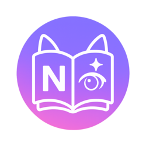

# Nlight

🌐 [Русский](.github/readme/README_ru.md) • [Українська](.github/readme/README_uk.md) • [English](.github/readme/README_en.md)

**Nlight** is an application for reading manga and ranobe, with support for Shikimori and catalogs in Russian and English.

---

## 🚀 Features

* 🔍 Browse, search, and read content
* 📚 Filter by genre, type, and sort order
* 🧩 Shikimori integration
* 🌗 Light and dark theme support
* 🌍 Available in 🇷🇺 Russian, 🇺🇦 Ukrainian, and 🇬🇧 English

---

## 📖 Supported Catalogs

### 📺 Anime

* Shikimori (🇷🇺)
* AniLib (🇷🇺)

### 📚 Manga

* Desu (🇷🇺)
* Shikimori (🇷🇺)
* MangaDex (🇷🇺, 🇬🇧)
* Remanga (🇷🇺)
* MangaLib (🇷🇺)

### 📘 Ranobe

* Rulate (🇷🇺)
* Erolate (🇷🇺)
* Ranobehub (🇷🇺)
* RanobeLib (🇷🇺)

### 🔞 Hentai Manga

* AllHentai (🇷🇺)
* NHentai (🇬🇧)

---

## 🖼️ Screenshots

|  |  |  |
| :---------------------------------------------------------------------------------------------------------: | :---------------------------------------------------------------------------------------------------------: | :---------------------------------------------------------------------------------------------------------: |

---

## 🧩 Contribution & Support

You are welcome to:

* Suggest improvements
* Report issues or bugs
* Help with translations

---

## 📄 License

This project is licensed under the [MIT License](LICENSE).

---