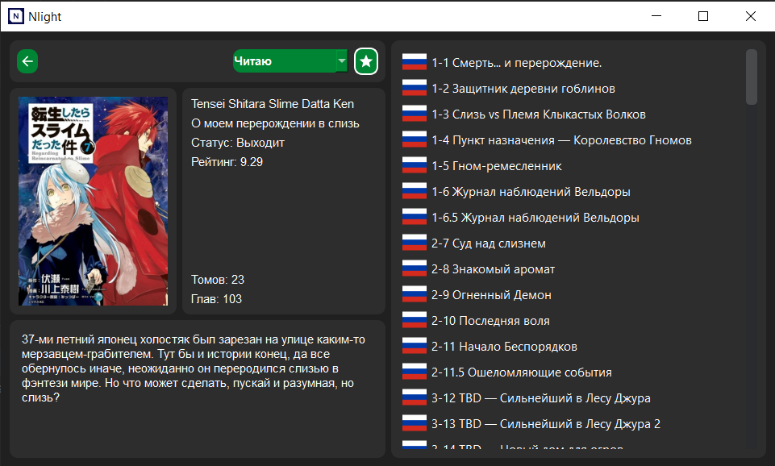
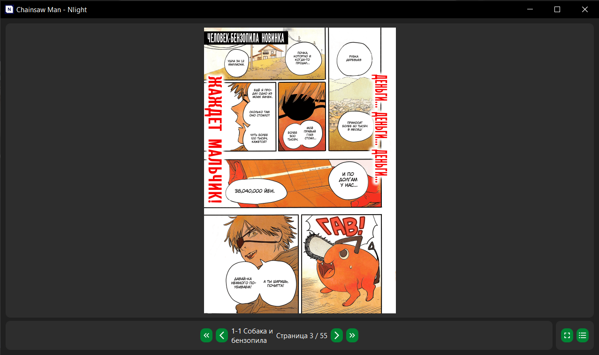

## Nlight


Open source manga and ranobe reading application

## Features

    - Browse, search, and read.
    - Filter by genre, kind and sort order
    - Shikimori support
    - Light and dark themes
    - Available in 🇷🇺Russian 🇺🇦Ukrainian and 🇬🇧English languages

## Currently supported catalogs

    Manga:
     - Desu (🇷🇺)
     - Shikimori (🇷🇺)
     - MangaDex (🇷🇺, 🇬🇧)
     - Remanga (🇷🇺)

    Ranobe:
     - Rulate (🇷🇺)
     - Erolate (🇷🇺)
     - Ranobehub (🇷🇺)

    Hentai Manga:
     - NHentai (🇬🇧)

## Screenshots

|  |  |  |
|-----------------------------------------|-----------------------------------------|-----------------------------------------|

## Installation

1. Clone the project repository:
    ```bash
    git clone https://github.com/brandonzorn/Nlight.git
    ```

2. Navigate to the project directory:
    ```bash
    cd Nlight
    ```

3. Install the required dependencies from the `requirements.txt` file:
    ```bash
    pip install -r requirements.txt
    ```

4. Once the dependencies are installed, you can run the application by executing the `main.py` file:
    ```bash
    python main.py
    ```